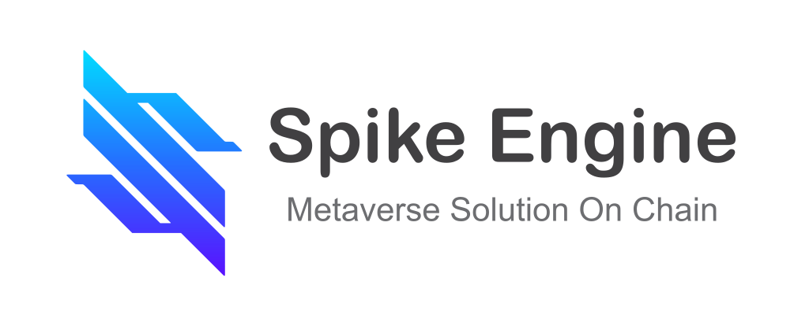

# Spike Engine

  

## A Cross-Platform and Web3-focused Game Development Solution

[Spike Engine](https://www.spike.fun) is a game-changing solution for cross-platform game development, offering a unique combination of modular gameplay development, Web3 integration, advanced graphics technology, and easy-to-use tools.

### Modular Gameplay Development:
One of the key features of Spike Engine is its support for modular gameplay development. This means that game developers can create game modules that can be reused by other developers to build their own games. This helps to reduce the time and effort required to develop complex games and enables developers to focus on creating unique game experiences.

### Web3 Integration:
Spike Engine is designed with Web3 technology at its core, which means that it offers seamless integration with decentralized networks and protocols. This enables developers to create games that leverage the benefits of blockchain technology, such as transparent and secure transactions, provable scarcity, and community ownership.

### Advanced Graphics Technology:
Spike Engine utilizes cutting-edge graphics technology to provide stunning visual experiences for players. The engine supports a wide range of graphic APIs, including OpenGL and DirectX, to ensure maximum compatibility across different platforms.

### Easy-to-Use Tools:
The Spike Engine platform is designed to be easy to use for game developers, with a user-friendly interface and a wide range of tools to support the development process. This includes an intuitive drag-and-drop system, a scripting engine, and a visual scripting tool.

## Free & open source
Spike is free and open source under the very permissive [MIT license]().

## Getting the engine

### Download

[Homepage](https://www.spike.fun/download)
